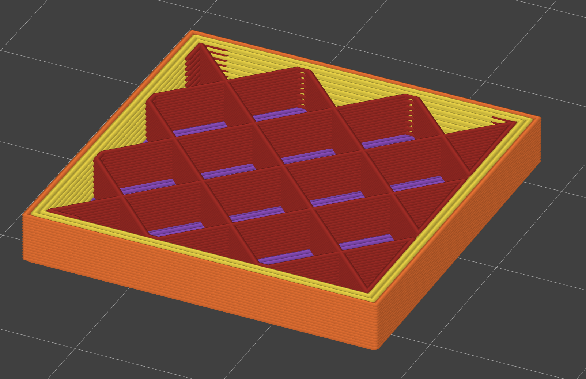
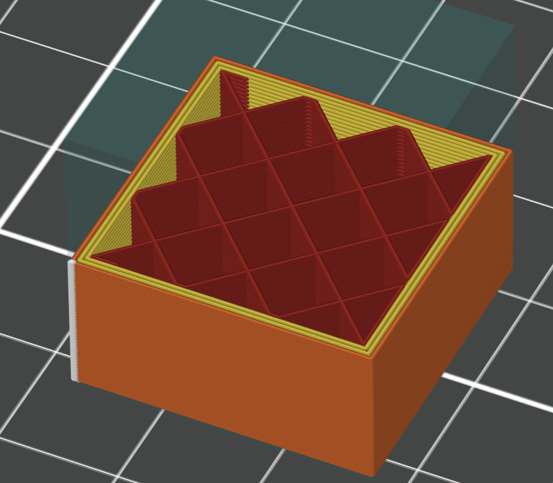

# Alternate extra wall — a PrusaSlicer slicing plugin

A `slicing.perimeter_planner` plugin for PrusaSlicer 3.x. It adds **one wall on every other
layer**, so the infill ends up wedged vertically between walls instead of meeting the same
face all the way up the part.

## The problem

A wall count is one number for the whole object. Every layer's innermost wall therefore sits at
the same radius, and the infill meets it along the same line from the bed to the top. That line
is a seam running the height of the part, and it is where the part comes apart — the infill is
butted against a continuous face rather than keyed into anything.

Give every other layer one more wall and the innermost wall alternates between two radii. The
infill on one layer now sits slightly inboard of the infill on the next, with wall between
them: it is keyed in vertically rather than stacked against a flat face.

OrcaSlicer ships this as `alternate_extra_wall`. **PrusaSlicer has no equivalent** — its wall
count is fixed for the object, and the only per-layer variation it offers is the automatic
extra perimeter on overhangs.

## Side by side with OrcaSlicer

The same part cut open in both slicers — this plugin on the left, OrcaSlicer's own
`alternate_extra_wall` on the right:

| this plugin, on the fork | OrcaSlicer |
|---|---|
|  |  |

Yellow is inner wall, orange is the external one, dark red the sparse infill. The thing to look
for is the same in both: the infill runs the full area and passes **under** the extra wall of
the layer above, rather than stopping against one continuous face that repeats all the way up
the part.

The purple in the left-hand shot is the **bottom solid shell**, seen down through the infill
cells — not solid infill between the walls. Measured over everything between the bottom and top
shells, that part carries **0.00 mm³ of solid infill**; 2 259 mm³ of sparse infill, 2 468 mm³ of
wall and nothing else. Worth saying because an earlier version of this plugin did put solid
infill in that band, and that is the one thing a reader comparing these two pictures should
check.

### The infill patterns are not the same, and that is worth knowing

The two pictures were not sliced with the same infill. Straight from the two files:

| | pattern | density | walls |
|---|---|---|---|
| this plugin | `grid` | 15 % | 2 |
| OrcaSlicer | `crosshatch` | 15 % | 2 |

**Cross Hatch is OrcaSlicer's default sparse infill and PrusaSlicer has no equivalent.** It is a
pattern that shifts direction as it climbs rather than stacking the same lattice, so how much an
alternating wall buys on top of it is a different question from how much it buys on top of a
grid. Take the comparison as showing that the two slicers do the same thing to the *wall*, not
as a like-for-like on the infill.

Cross Hatch is a candidate for a plugin of its own here — it is a fill pattern, so it needs
`slicing.fill_planner`, the hook `radial-bridge` already uses. **When that plugin exists, this
page should be re-sliced against it and this section brought up to date.**

## What it costs

Sliced from OrcaSlicer's own test project, the same part with and without the plugin:

| | without | with |
|---|---|---|
| inner wall moves, alternating layers | 4 | **8** |
| inner wall moves, other layers | 4 | 4 |
| external perimeter | unchanged | unchanged |
| solid infill in the middle layers | none | **none** |
| material | 5 443 mm³ | **6 268 mm³** (+15.2 %) |
| estimated time | 19m57s | **19m59s** (+2 s) |

The material goes up a lot and the time barely moves, which is the shape of the trade: the
extra wall displaces sparse infill, so the head travels much the same distance but lays solid
wall where it used to lay a 15 % lattice.

**The row that says "none" took an engine change to get right.** The slicer's vertical shell
check reads the area left inside the innermost wall and treats everything outside it as shell
that the layers above and below have to back up. An extra wall shrinks that area on its own
layer, so the first version of this plugin had the slicer lay solid infill in that band on
every layer that *did not* get the wall — 9 mm³ a layer of it. That is worse than doing
nothing: the whole point of alternating the wall is that the infill is keyed in vertically
rather than meeting one continuous face, and filling the band solid welds that face back
together. The fix measures the shell as if the plugin's walls were not there, so the sparse
infill now runs the full area and out under the next layer's extra wall, which is what
OrcaSlicer does. It needs the fork at `dc956467ef` or later.

**It buys strength and nothing else.** On a part that is not loaded it is 17 % of your filament
spent on nothing. On a thin-walled part there may be no room for the extra wall to go, and the
plugin will simply find the slicer has given it a count it cannot improve on.

## Settings

`settings.lua` next to the Lua source. Edit and slice again; no restart, no rescan. It is read
inside a `pcall`, so **a syntax error in it is reported nowhere** — the file is ignored and the
defaults apply.

| setting | default | what it does |
|---|---|---|
| `extra` | `1` | How many walls to add. One is what the effect is named after and what it needs: the point is that the innermost wall alternates between two radii, and it does that at one. `0` turns the plugin off. |
| `every` | `2` | Add them on every Nth layer. Below 2 the plugin does nothing — "every layer" is just a higher wall count and belongs in the print settings. |
| `phase` | `1` | Which layer of each cycle gets the extra wall, as `layer_id % every`. Only decides where the alternation starts. |
| `skip_first_layers` | `1` | Leave this many layers at the bottom alone. The first layers are about adhesion, not strength, and changing the count there moves the seam on the face that sits on the bed. |

## The hook it needs

`slicing.perimeter_planner`, which is not "alternate extra wall" but:

> given a layer and the region about to have its perimeters generated, decide how many there
> will be.

The same mechanism serves more wall through a band that will be tapped or threaded, more wall
near the top and bottom faces where the load goes, fewer wall in a tall thin feature that is
only there for looks, and more wall where a support is going to be prised off.

Requires the fork: <https://github.com/dzwiedziu-nkg/PrusaSlicer>.

## Running it

Symlink the bundle into the slicer's datadir, by the name in `manifest.json`:

```bash
ln -sfn "$PWD/com.github.dzwiedziu-nkg.alternate-extra-wall" \
    ~/.config/PrusaSlicer3-dev/lua/
```

## License

AGPL-3.0-only. See `LICENSE`.
