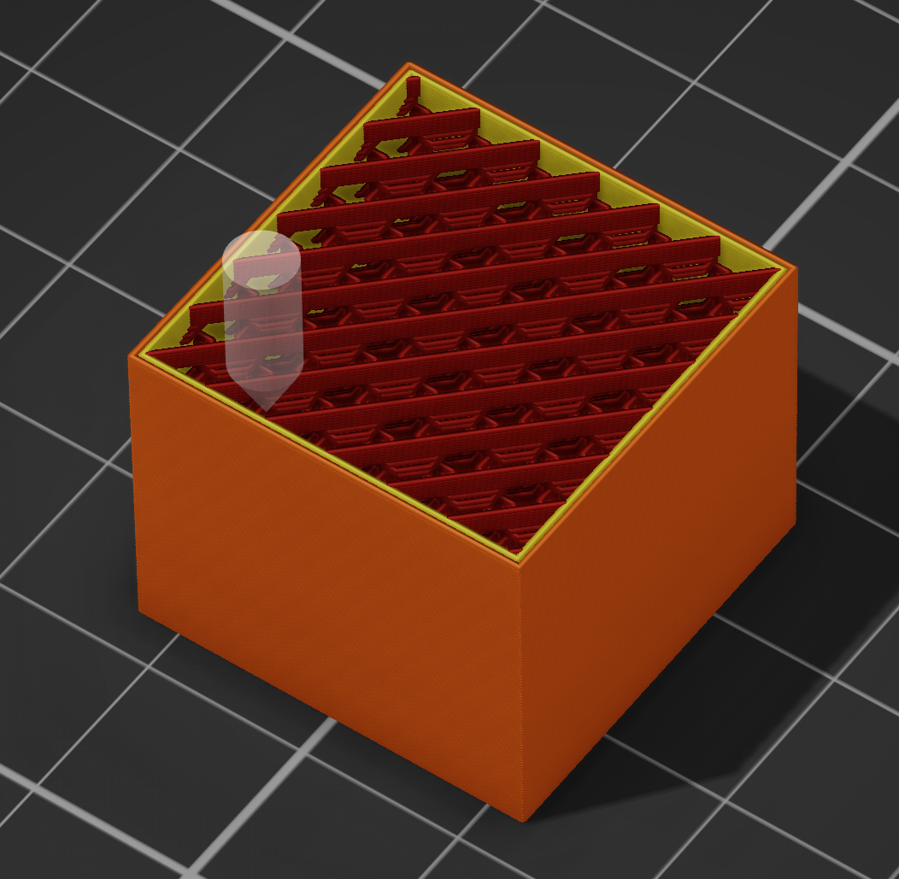

# Cross Hatch infill — a PrusaSlicer slicing plugin

A `slicing.fill_planner` plugin for PrusaSlicer 3.x. It is **3D Honeycomb with the straight
phase stretched over several layers**, which is what makes it stiff where plain 3D Honeycomb is
not.

> **This is OrcaSlicer's pattern.** Cross Hatch is theirs; this is a reimplementation of it for
> PrusaSlicer. The octahedron geometry follows PrusaSlicer's own `Fill3DHoneycomb`, credited
> there to David Eccles (gringer). Every number in `settings.lua` was measured off OrcaSlicer's
> output rather than guessed.

## What it is

PrusaSlicer already ships the tessellation: `3dhoneycomb` slices a stack of truncated
octahedra, so each layer is a zigzag whose amplitude rises and falls with Z. When the amplitude
reaches zero the zigzag flattens into **straight lines** — and that is the useful state, because
straight lines stacked on top of each other fuse into a wall that carries load.

Stock 3D Honeycomb passes through that state instantly. Its amplitude follows a sawtooth, so
the lines are straight for one layer out of nineteen, and the direction flips **every layer**
on top of that. Nothing gets a chance to fuse.

Cross Hatch holds the straight phase for a few millimetres — long enough for those layers to
become a wall — and then runs the zigzag to carry the pattern round to the perpendicular
direction, so the wall never runs the whole height of the part. It sits between `grid` (two
continuous walls all the way up, a plane to come apart along) and `rectilinear` (no wall at all,
consecutive layers crossing at right angles and touching at points).

**The direction turns at the peak of the zigzag, not in the straight phase.** At full amplitude
the pattern about 45° and the pattern about 135° are the same lattice, so the change is
invisible. That is `Fill3DHoneycomb`'s `curveType`, switched once per half period instead of
once per layer.

## In the preview



The pattern is easier to see than to describe. The dark red runs are the **straight phase**:
several layers at the same angle, stacked into continuous walls. Between and across them are the
**zigzag layers**, the trapezoidal shapes that tie one set of walls to the next and carry the
pattern round to the perpendicular direction.

That is the whole idea in one picture — walls where a wall is useful, and a break in them before
any wall runs the height of the part. `grid` would show two sets of walls going all the way up
with nothing tying them; `rectilinear` would show no walls at all.

## Measured, against OrcaSlicer's own file

The same part, layer by layer. "Straight" and "zigzag" here are the share of extrusion length
running along the line's own direction:

| Z | this plugin | OrcaSlicer |
|---|---|---|
| 1.00 – 2.40 | 45°, straight | 45°, straight |
| 2.60 – 3.20 | zigzag, **turning 45° → 135° at Z 3.00** | zigzag, **turning at Z 3.00** |
| 3.40 – 5.20 | 135°, straight | 135°, straight |
| 5.40 – 5.80 | zigzag, turning 135° → 45° | zigzag, turning |
| 6.20 – 7.20 | 45°, straight | 45°, straight |

Period, phase, where the straight runs sit and where the turn happens all agree. The zigzag
amplitude rises and falls as it should — measured 0.35, 0.96, 1.31, **1.40**, 1.31, 0.96,
0.35 mm across a transition, peaking at half a grid cell.

Two differences, both small and both explained:

- **Our straight layers measure 100 % along-direction where OrcaSlicer's measure 79–89 %.** That
  is the links: the stock filler joins consecutive lines with extruded arcs along the boundary,
  and a fill planner's paths are separate lines with a travel between them.
- **Our zigzag bottoms out at 66 % where theirs reaches 49 %**, which is the same links counted
  against the zigzag.

Material on a 20 × 20 × 16 mm block at 15 %:

| | infill filament |
|---|---|
| stock `rectilinear` | 893.0 mm³ |
| stock `3dhoneycomb` | 914.6 mm³ |
| this plugin | **771.7 mm³** (−14 %) |

Again the links, not lower density — the grid cell is `spacing / density` in all three.

## Settings

`settings.lua` next to the Lua source. Edit and slice again; no restart, no rescan. It is read
inside a `pcall`, so **a syntax error in it is reported nowhere** — the file is ignored and the
defaults apply.

| setting | default | what it does |
|---|---|---|
| `angle` | `45` | Direction of the straight runs, in degrees. |
| `half_period` | `2.7` | How far the pattern climbs between one straight run and the next, in mm. Longer means stiffer runs and taller continuous faces; shorter is more lattice-like. `0` turns the plugin off. |
| `transition` | `0.4444` | How much of each half period is the zigzag rather than the straight run, 0 to 1. `0` makes it plain `rectilinear`; `1` makes it something close to stock 3D Honeycomb, which is the thing this exists to improve on. |
| `z_offset` | `4.6` | Shifts the whole pattern up, in mm. Makes no difference to what the infill does; it exists so the output can be lined up with OrcaSlicer's. |
| `roles` | `InternalInfill` | Sparse infill only — solid, top and bridge surfaces have their own reasons for the pattern they use. |
| `skip_first_layers` | `0` | Leave this many layers at the bed alone. |

## Use it with `rectilinear`, not `grid`

Set `fill_pattern = rectilinear` (or `line`). Those lay **one** family of lines per layer, which
is what this pattern does, so the density you asked for is the density you get. Under `grid` the
slicer works its spacing out for two families crossing on every layer, and one family at that
spacing comes out at half the density.

## The hook it needs

`slicing.fill_planner`, which is not "cross hatch" but:

> given a surface the slicer is about to fill, lay the paths for it.

Requires the fork: <https://github.com/dzwiedziu-nkg/PrusaSlicer> at `529aba88b2` or later, with
the hook at API 1.2.0 — that is the version which tells a planner the **density**, without which
it cannot know how big the octahedron's cell is.

## Running it

```bash
ln -sfn "$PWD/com.github.dzwiedziu-nkg.cross-hatch" \
    ~/.config/PrusaSlicer3-dev/lua/
```

## License

AGPL-3.0-only. See `LICENSE`.
