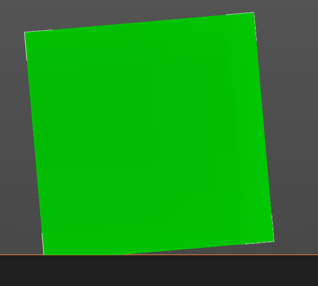
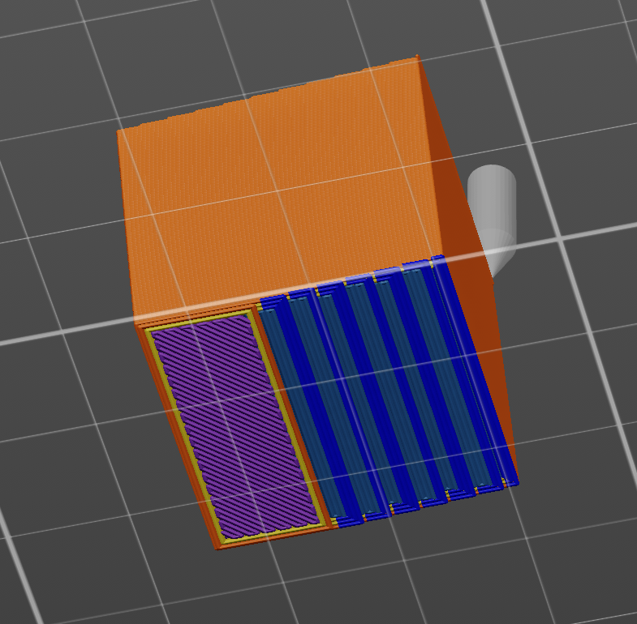
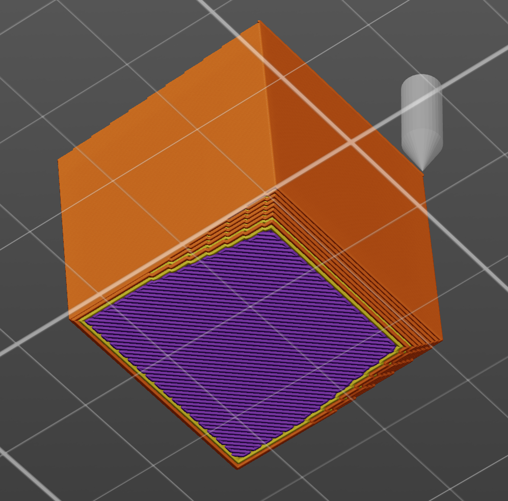

# Make overhang printable — a PrusaSlicer slicing plugin

A `slicing.slice_planner` plugin for PrusaSlicer 3.x. It **carries an overhang on a cone of new
material built up from underneath**, so the printer lays it on a slope it can hold instead of
onto air.

> **This is OrcaSlicer's algorithm.** The feature is theirs — `make_overhang_printable`, with
> `make_overhang_printable_angle` — and this plugin is a reimplementation of it for PrusaSlicer,
> which has no equivalent. On the same part in the same place the two produce the same cone to
> within 0.003 mm a layer; the measurements are below. Credit for the idea and for the default
> angle belongs to OrcaSlicer.

## The problem

A layer is an outline cut from the mesh, and the slicer prints it whether or not the printer can
hold it up. Where the model juts sideways, the layer above starts in mid-air: the bead curls
downward, the nozzle drags through the curl on the next pass, and the underside comes out rough.

There are exactly two ways to stop that happening. Take the overhang off, or put something under
it. This plugin puts something under it — **nothing of the model is lost**. Taking it off instead
is the [`overhang-chamfer`](../overhang-chamfer/) plugin, and on a small ledge that is usually
the better trade.

## What it does

Each layer is made to cover at least the layer above shrunk by `layer_height / tan(angle)`.
Walked downward, that grows a cone at exactly that slope, from the overhang down to whatever
holds it up — the part, or the bed.

The angle is PrusaSlicer's convention, the one `support_material_threshold` uses: **90° is
vertical and the number is the most horizontal slope printable without support.** The default is
**35°**.

**OrcaSlicer's `make_overhang_printable_angle` is the same quantity measured from the other
side**, and its default of 55 is this plugin's 35. That is not an assumption — read off
OrcaSlicer's own output for the test part, the cone advances **0.2855 mm per 0.2 mm layer**, and
`0.2 / tan(35°)` is 0.2856.

## In the preview

The test part is a cube tipped about 5° off vertical, so it stands on one edge and its whole
underside is a near-flat overhang:



Sliced without the plugin and with it, seen from underneath:

| without the plugin | with the plugin |
|---|---|
|  |  |

On the left the underside is **blue** — bridge infill in the darker shade, overhang perimeter in
the brighter one. Every one of those beads is laid onto air. On the right there is no blue at
all: the underside is ordinary solid infill in purple, wall in orange and yellow, and along the
edges you can see the cone climbing as a run of stepped contours.

That is not just how it looks. Measured over the bottom 3 mm of the part:

| | bridge infill | overhang perimeter |
|---|---|---|
| without the plugin | 91.0 mm³ | 30.8 mm³ |
| with the plugin | **0.0 mm³** | **0.0 mm³** |

The 197.1 mm³ of bridge infill left in the whole-part figures further down is all above that,
over the sparse infill, and is not something this plugin has any business touching — it is
identical with and without.

## Measured, against OrcaSlicer's own output

The same part and the same placement: a wedge whose underside runs at about 5° from
horizontal — nearly flat, and the worst case there is.

| | no plugin | this plugin | OrcaSlicer |
|---|---|---|---|
| layers whose outline exceeds the bound | **7** | **0** | **0** |
| worst single step | 2.511 mm | **0.511 mm** | **0.511 mm** |
| overhang perimeter | 30.8 mm³ | **0.00 mm³** | — |
| bridge infill | 288.1 mm³ | **197.1 mm³** (−32 %) | — |
| material | 5.09 cm³ | 5.14 cm³ (+1.0 %) | 5.29 cm³ |
| estimated time | 20m 59s | 21m 00s (+1 s) | 22m 11s |

**Every 90° overhang is gone** — not reduced, zero. The 0.511 mm step that remains is not an
overhang at all and is identical in OrcaSlicer's output: the first layer is extruded 0.50 mm
wide against 0.45 mm above it, so its centre line sits further in than the outline does.

OrcaSlicer does not label overhang walls with their own G-code type, so those two rows have no
Orca column; and its sparse infill is `crosshatch` against our `grid`, so **the material and
time columns are not like-for-like across slicers.** The +1.0 % and +1 s are ours against ours,
and those are the honest numbers.

### The cone is the same cone OrcaSlicer builds

Not approximately — layer for layer, on the same part in the same place:

| Z | this plugin | OrcaSlicer |
|---|---|---|
| 0.20 | 113.918 | 113.915 |
| 0.60 | 113.122 | 113.119 |
| 1.00 | 112.551 | 112.548 |
| 1.60 | 111.694 | 111.691 |
| 2.40 | 111.764 | 111.761 |

**0.003 mm apart at every layer**, which is placement rounding and not the cone. Both slope at
0.2855 mm per 0.2 mm layer, both stop in the same place, both leave the same first-layer
artefact. One does it by moving mesh vertices before slicing and the other by clipping slice
outlines during it, and the answers land on top of each other.

> **A note on these figures.** They were re-measured after a bug in the measuring script: it
> summed every `E > 0`, which counts **deretractions** — the filament pushed back after a travel
> — as material on the part. That inflates any pattern with more travel than the stock one, so
> the numbers below are lower than the ones this page carried at first. The conclusions did not
> move; the arithmetic did.

## What it costs

**The part comes out larger than the mesh**, with a skirt of material that was not modelled. That
is the mechanism, not a side effect, and if the cone is in the way it has to be cut off after the
print — which is also true of support, except that this is fused to the part rather than resting
against it.

So the choice between this and a chamfer is: **lose a little of the model, or gain a cone you may
have to trim.** For a small ledge, losing it is usually better. For a real overhang you want to
keep, this is the one.

Unlike a chamfer, the cone cannot run away: it terminates where it meets the part or the bed. So
`max_width` defaults to 0 — no limit — which is also what OrcaSlicer does.

## Only one slice planner at a time

The slicer loads **one** plugin of each type, so `make-overhang-printable` and `overhang-chamfer`
cannot both be installed: symlink one or the other. That is not much of a loss, because they are
two answers to the same question and this one already handles overhangs of any size. If you do
want small ledges chamfered and large ones coned, the two belong in a single plugin — they share
the hook, and the difference is one word in the answer.

## Settings

`settings.lua` next to the Lua source. Edit and slice again; no restart, no rescan. It is read
inside a `pcall`, so **a syntax error in it is reported nowhere** — the file is ignored and the
defaults apply.

| setting | default | what it does |
|---|---|---|
| `angle` | `35` | The steepest underside the model may keep, in degrees from horizontal; 90 is vertical. The same quantity as OrcaSlicer's `make_overhang_printable_angle` measured from the other side, so 35 here is its default of 55. `0` turns the plugin off. |
| `max_width` | `0` | The most material the cone may add, in mm, as the largest disc that fits inside it. `0` is no limit, which is the ordinary setting and what OrcaSlicer does. |
| `min_z` | `0.0` | Leave everything below this height alone. |

## The hook it needs

`slicing.slice_planner`, which is not "make overhang printable" but:

> given a layer as it comes off the mesh, decide how far its outline may reach past the layer
> below — and, where it reaches too far, whether to cut it off or to hold it up.

The `"fill"` remedy is this plugin; `"clip"` is the chamfer. The same mechanism serves a plugin
that makes only the first few millimetres self-supporting, one that tightens the angle towards
the top of a tall part, and one that leaves the model alone below a given Z.

Requires the fork: <https://github.com/dzwiedziu-nkg/PrusaSlicer> at `97929f43c9` or later,
with the hook at API 1.1.0. Earlier commits split the first layer in two wherever
`elefant_foot_compensation` is set.

## Known difference from OrcaSlicer

`make_overhang_printable_hole_size` is not implemented. OrcaSlicer can fill holes in the base of
the cone below a given area; here a hole in the model propagates down through the cone and widens
as it goes, which is what the geometry does on its own. Nobody has needed the other behaviour
yet.

## Running it

Symlink the bundle into the slicer's datadir, by the name in `manifest.json`:

```bash
ln -sfn "$PWD/com.github.dzwiedziu-nkg.make-overhang-printable" \
    ~/.config/PrusaSlicer3-dev/lua/
```

## License

AGPL-3.0-only. See `LICENSE`.
