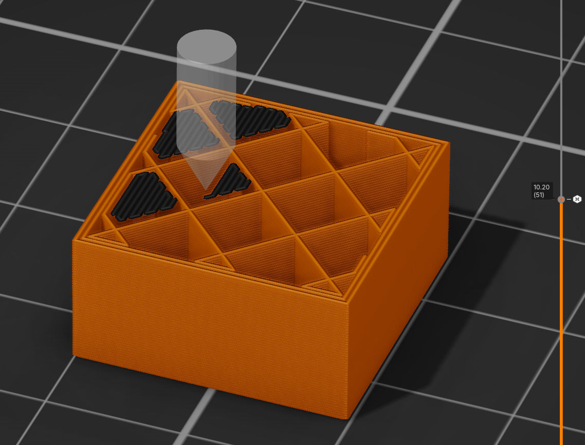
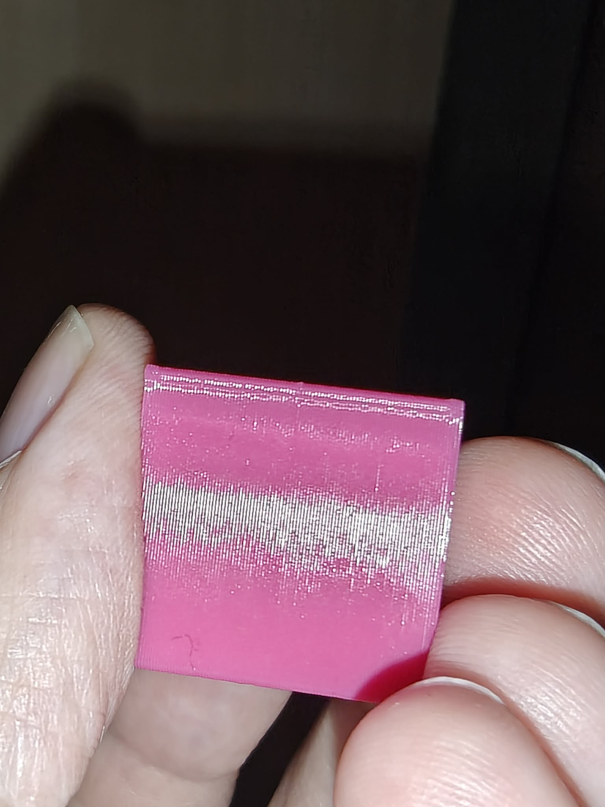
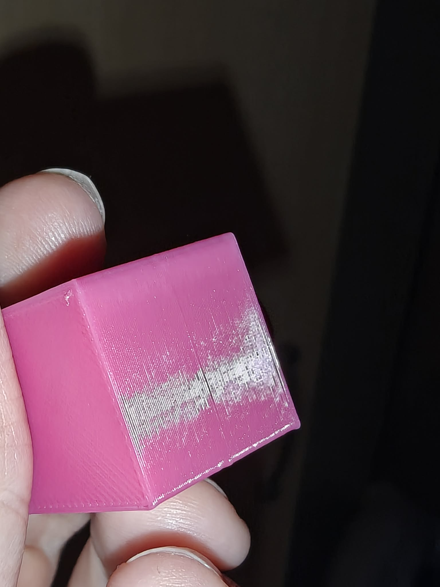

# Purge after a pause — a PrusaSlicer slicing plugin

A `slicing.resume_planner` plugin for PrusaSlicer 3.x. It puts a purge in the room the layer's
own infill leaves and makes it the **first thing printed** after a pause or a colour change.

## The problem

Schedule a pause at a layer — to drop a nut into a pocket, say — and the printer stops with a
hot nozzle and no movement. It drips. What comes back is a melt of unknown temperature,
unknown pressure and unknown volume, and the slicer's answer to that is the prime in
`color_change_gcode`:

```gcode
M600
G1 E0.3 F1500 ; prime after color change
```

0.3 mm of filament is **0.72 mm³**. A melt zone is 15–40 mm³. So the prime replaces something
between 2 % and 5 % of what was sitting in the nozzle.

Two things follow on the print, and both were what prompted this plugin:

- **The first extrusions come out starved.** Sliced from a 19.5 mm square with a pause at
  Z = 10.2, the stock resume goes straight into a perimeter and reaches the **external**
  perimeter — the visible one — after about 7.8 mm³ in total. On a small object the wall you
  will be looking at is printed before the flow has settled.
- **The drip lands on a wall.** The slicer emits the interruption *after* the travel, at the
  first extrusion point, so the first thing the nozzle touches when it comes back is whatever
  it was about to print. Usually a perimeter.

## What it does

It asks the slicer for a purge in the empty space between the layer's own sparse infill lines,
printed before anything else on that layer. The order that results is:

```
travel to the purge patch  →  M601 / M600  →  purge  →  the layer's own work
```

The printer comes back from the pause onto the purge patch rather than onto a perimeter. The
drip lands between infill lines where nobody will see it, the purge drives out what was left in
the melt, and only then does the real work start.

**It needs no wipe tower**, no room on the bed and nothing printed from the first layer up. The
purge is inside the part and at the layer's own Z, so nothing stands proud for the next layer's
nozzle to hit — and what it costs is not really waste, since the filament stays in the object
as extra material.



The preview at the pause layer of the test part — a compartment box, paused at Z = 10.2 so that
bearings can be dropped into the slots. The dark patches sitting in the cells of the sparse
infill grid are the purge. They are inside the part, they are at the layer's own height, and
nothing of them will ever be seen once the box is closed over.

## On the printer

This is what it is for, and it is the largest thing the plugin buys:

| | |
|---|---|
|  |  |

A 19.5 mm square with a pause halfway up. **The wall is continuous through the pause — no gap,
no starved band.** Before the plugin, a pause on an object this small reliably left one: the
external perimeter is reached seconds after the resume, and the melt had not recovered by then.

What is left is the faint horizontal mark you can see on the right-hand photo, a slight ridge
where the layer restarted — a Benchy hull line, if you like. It is a cosmetic seam rather than
a hole, and on a small part it is a very large improvement on what was there before.

### What happens after the pause

[](https://www.youtube.com/shorts/wEw-s56fzEk)

*[Watch on YouTube](https://www.youtube.com/shorts/wEw-s56fzEk)* — the nozzle comes back from
the pause, lands on the purge patch inside the part, drives out what was sitting in the melt,
and only then goes to the perimeter. The drip that would otherwise have welded itself to the
wall lands between infill lines instead.

## Settings

`settings.lua` next to the Lua source. Edit and slice again; no restart, no rescan. It is read
inside a `pcall`, so **a syntax error in it is reported nowhere** — the file is ignored and the
defaults apply.

| setting | default | what it does |
|---|---|---|
| `volume` | `25.0` | mm³ to put through the nozzle. The melt zone is the quantity that matters: below it, some of what sat in the nozzle through the pause is still there when the first perimeter is printed. A layer with less room gives what it has. |
| `kinds` | `Pause`, `ColorChange`, `ToolChange` | Which interruptions to purge after. `Template` and `Custom` are left out because they are whatever the user put there, and may not stop the print at all. |
| `min_spare_volume` | `5.0` | Don't bother below this much room. A solid layer has nowhere to put a purge, and one with barely any room is not worth the travel — the drip lands on the way there and what fits is too small to replace the melt. |

## The hook it needs

`slicing.resume_planner`, which is not "purge after a pause" but:

> given an interruption in the print and the layer it resumes on, plan what puts the nozzle
> back into a known state before the layer's own work starts.

The plugin is handed the kind of interruption, the layer, and **how much room that layer has to
spare** — so it can ask for a melt zone's worth if there is space and decline if there is not.
A different plugin on the same hook might ramp the temperature back up, or spend nothing on a
large object whose first perimeter is hidden.

Requires the fork: <https://github.com/dzwiedziu-nkg/PrusaSlicer>.

## Running it

Symlink the bundle into the slicer's datadir, by the name in `manifest.json`:

```bash
ln -sfn "$PWD/com.github.dzwiedziu-nkg.purge-after-pause" \
    ~/.config/PrusaSlicer3-dev/lua/
```

Then slice anything with a pause or a colour change set on a layer.

## License

AGPL-3.0-only. See `LICENSE`.
