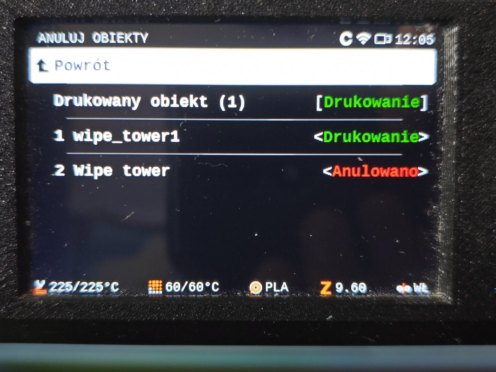
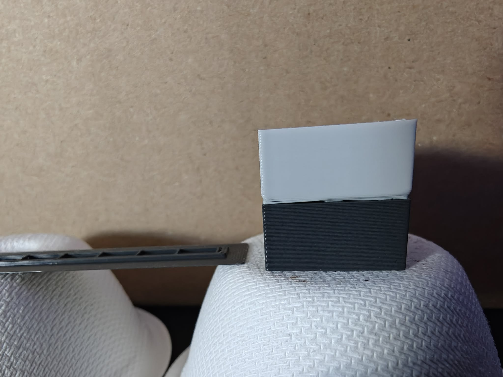

# Cancellable wipe tower — a PrusaSlicer slicing plugin

A `slicing.object_labels` plugin for PrusaSlicer 3.x. It puts the wipe tower on the list
of objects the printer can cancel during a print.

## The problem

Cancel Object works from a list the slicer writes into the G-code — `M486` on Marlin and
Prusa Buddy, `EXCLUDE_OBJECT` on Klipper, `; printing object` comments for OctoPrint. That
list holds model objects, and only model objects. Everything else the printer lays down
belongs to nothing and can therefore be cancelled by nobody.

The wipe tower is the part of the print where that hurts. Cancel the object that needed
two filaments — it lifted, it failed, you changed your mind — and the tower does not go
with it. It carries on being built, layer after layer, by itself, for however long the
print had left, purging filament into a thing nothing is waiting for.

## What this does

Names it. Once the tower has a name it is defined in the same header as the objects, in
whatever dialect the printer speaks, and it appears in the printer's Cancel Object menu
next to them.



The tower is the second entry, and it cancels like any object.

Naming is genuinely all the plugin does — thirty lines of Lua. The slicer owns the syntax
and, more to the point, owns where the boundaries of the tower are drawn:

- The **tool change** spliced into the middle of the tower's G-code sits *outside* the
  label. Whatever a given firmware does with a cancelled object, it cannot skip a `T`
  command that is not inside one, so cancelling the tower can never leave the rest of the
  layer printing in the wrong filament.
- The **travel** to the tower and the **acceleration** set around it are outside it too,
  so a cancelled tower cannot leave the printer accelerating like a wipe tower for the
  object that comes next.
- The tower's own moves — the ramming and the purge — are what is inside, and what a
  cancelled tower actually skips. **Read the next section before you use that**; losing
  the purge is not a detail.

## Read this before you cancel one

**Cancelling the tower cancels the purge with it.** The purge is the tower's whole reason
to exist: after a tool change the nozzle is still full of the previous filament, and the
tower is where that gets pushed out. Cancel the tower and the tool changes still happen —
that part is protected by design — but the old colour now leaves the nozzle *on the
object*, over a long stretch of extrusion, until it clears itself.



That is what it looks like. The transition is not a line, it is a band: the whole first
part of the new colour is the old one working its way out. The slicer warns about this on
every slice with the plugin installed, and the warning is not decorative.

**So: cancel the tower only once nothing left to print needs it.** That is the case this
plugin is for — the objects that required a second filament are done or cancelled, no tool
change is coming, and the tower is the only thing still keeping the printer busy for the
next hour. Then cancelling it costs nothing at all.

Cancel it with tool changes still to come and you have chosen an unpurged print. The
ramming that shapes the filament tip goes the same way, so expect a blunter tip than the
printer planned for as well. Nothing mechanically necessary is skipped, and nothing here
can jam or crash — but the result is not the print you sliced.

There is no clever middle setting, and it is worth saying why so nobody builds one: making
only the tool-change blocks cancellable would keep the purges and drop the layers that hold
the tower up, which means purging onto a tower with holes in it, and making only the
non-tool-change blocks cancellable would save almost nothing. The tower is all or nothing.

The plugin cannot make the judgement for you and deliberately does not try — it hands the
printer the option and leaves the decision where it belongs, which is with whoever is
standing in front of it.

## Settings

**There is no user interface for this — the file is the interface.** PrusaSlicer's
_Plugins_ menu, and the parameter dialog behind it, only ever list plugins of type
`project.plugin`, the ones you invoke yourself. A slicing plugin is not invoked; it hooks
into the slicing itself, so it never appears there and has nothing to click. Everything it
can be told is in `settings.lua`.

The file lives inside the plugin's bundle directory, next to the plugin's own `.lua`:

```
~/.config/PrusaSlicer3-dev/lua/com.github.dzwiedziu-nkg.wipe-tower-cancel/settings.lua
```

If you installed the plugin by symlinking your checkout — which is the sane way — that
path is the symlink and editing the file in the checkout is the same thing.

It is a Lua file that returns one table, so an entry is `key = value,` with the comma, and
`--` starts a comment. Strings take quotes, booleans are `true` / `false`, and a value in
`{ }` is a table of its own. Comment a line out and the plugin's built-in default applies:

```lua
return {
    names = {wipe_tower = "Tower"},   -- the rest keep their defaults
}
```

**Save it and slice again — that is all.** No restart, no _Rescan_: the plugin directories
are read afresh for every slice.

One warning about how it fails. The plugin loads the file inside a `pcall`, so a **syntax
error is not reported anywhere** — the file is simply ignored and every default applies. If
a change of yours seems to do nothing at all, that is the first thing to suspect: a missing
comma, a missing brace, a stray quote.

The keys, in full:

| key | default | meaning |
|---|---|---|
| `labelled_regions` | `wipe_tower` | Which parts of the print that are not objects become cancellable. |
| `names` | `{}` | What to call them. Unset means the slicer's own name. |

Both take tables, keyed by the kind of region:

```lua
return {
    -- Set a kind to false, or leave it out, and that part of the print stays
    -- unlabelled — which is what the stock slicer does.
    labelled_regions = {wipe_tower = true},
    -- Optional. Without it the slicer's own name is used, which is "Wipe tower".
    names = {wipe_tower = "Tower"},
}
```

`wipe_tower` is the only kind the slicer offers so far. The setting is a table rather than
a boolean because the hook is general: when the engine learns to hand over the skirt, the
brim or the supports, they will show up here under their own keys.

A name reaches the printer's display, so keep it short and keep it recognisable at a
glance — you will be reading it on a small screen, under a menu called Cancel Objects,
next to the objects it must not be confused with.

## Requirements

**This plugin does not work with an official PrusaSlicer release.** The `slicing.object_labels` API does
not exist in PrusaSlicer 3.x as shipped; it is added by a fork:

- the fork, branch `main`, which carries all five hooks: https://github.com/dzwiedziu-nkg/PrusaSlicer
- how to build and run it: https://github.com/dzwiedziu-nkg/PrusaSlicer/blob/main/doc/Build_plugin_fork.md
- the API contract: `doc/Plugin_API.md` in those sources

It also needs two things that have nothing to do with the fork:

- **Label objects** switched on: Print Settings → **Precision & Slicing** → *Resolution &
  G-code Data*. Without it the slicer writes no object list at all, and there is nothing
  for the tower to join. Prusa's own print profiles set it to *Firmware-specific* already,
  so on a stock profile there is nothing to do; the engine's own default is Disabled.
  (In PrusaSlicer 2.x this setting lived under Output options. It moved.)
- A printer with a wipe tower on the plate. With no tower there is no region to name, and
  the G-code comes out byte for byte as it would without the plugin.

Prusa have said they intend to expose the slicing pipeline to plugins themselves. When they
do, this plugin should be rewritten against their interface and the fork dropped.

## Installing

```bash
ln -s "$PWD/com.github.dzwiedziu-nkg.wipe-tower-cancel" ~/.config/PrusaSlicer/lua/
```

The directory name has to match the `id` in `manifest.json`. The plugin has no menu entry.
The log names it at the start of every slice and says what it named:

```
[info] Object labels plugin in use: com.github.dzwiedziu-nkg.wipe-tower-cancel.wipe_tower_cancel
[info] Object labels plugin ... named the wipe_tower "Wipe tower"
```

In the G-code itself, the tower's definition sits with the objects in the header, and its
extrusions are wrapped in the same start and stop lines the objects get.

The slicer also raises a warning on every slice where the tower has been named, saying what
cancelling it costs. That is deliberate: the choice is made on the printer, hours later,
where there is nothing left to warn you.

## Limitations

- The priming lines, on printers that lay them down before the print, are inside the
  tower's label but outside its declared footprint. Nothing acts on that discrepancy —
  priming is over long before a print can be cancelled — but a printer that draws the
  cancel outlines will not draw them.
- One name for the whole tower. Cancelling it cancels all of it, from that moment to the
  end of the print; there is no way to skip just the next few purges, and no way to change
  your mind for the next tool change only.
- The footprint is the bounding box of the tower's extrusions, not their outline. For a
  rectangular tower those are the same thing.
- What a cancelled object means is the firmware's business, not the slicer's. The
  boundaries here are drawn so that the mechanically necessary parts are outside the label
  under any reading of it, but the plugin cannot verify what your printer does with one.

## License

AGPL-3.0-only, the same licence as PrusaSlicer itself. The full text is in `LICENSE`.
